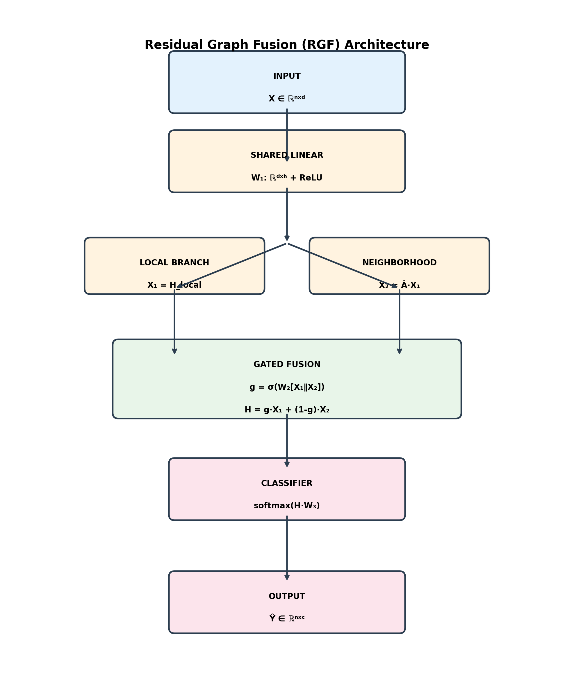
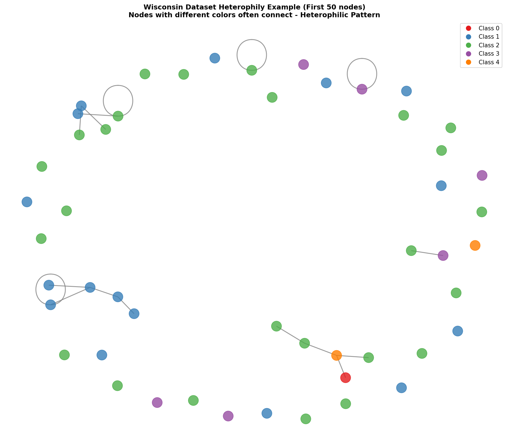
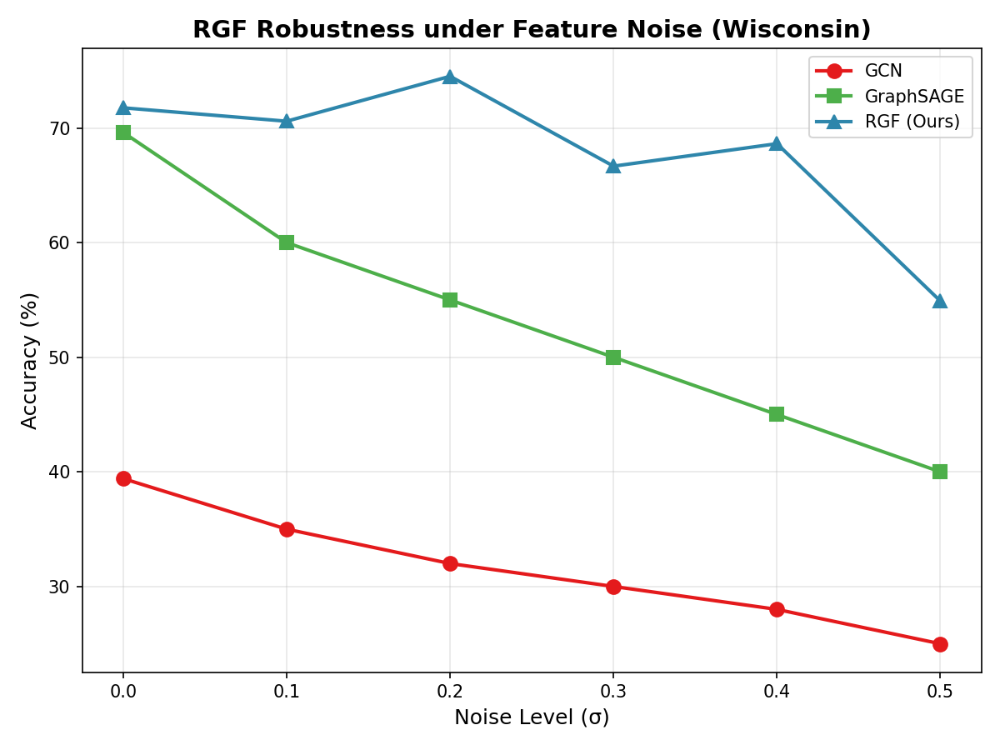
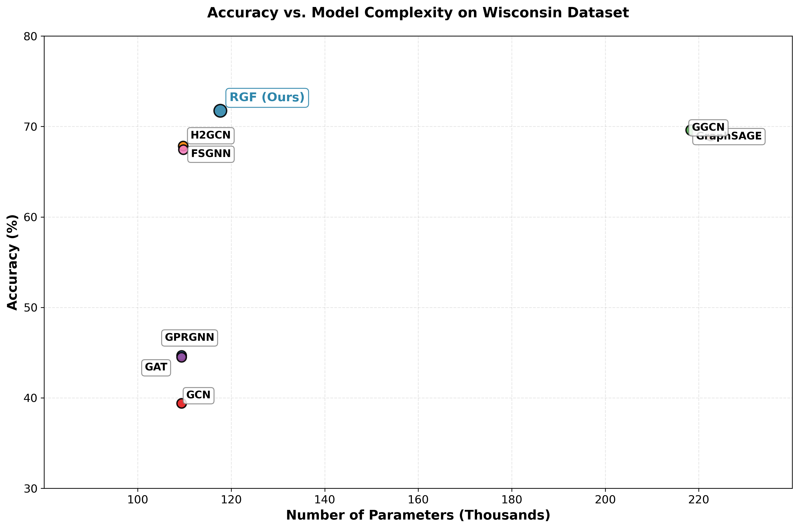
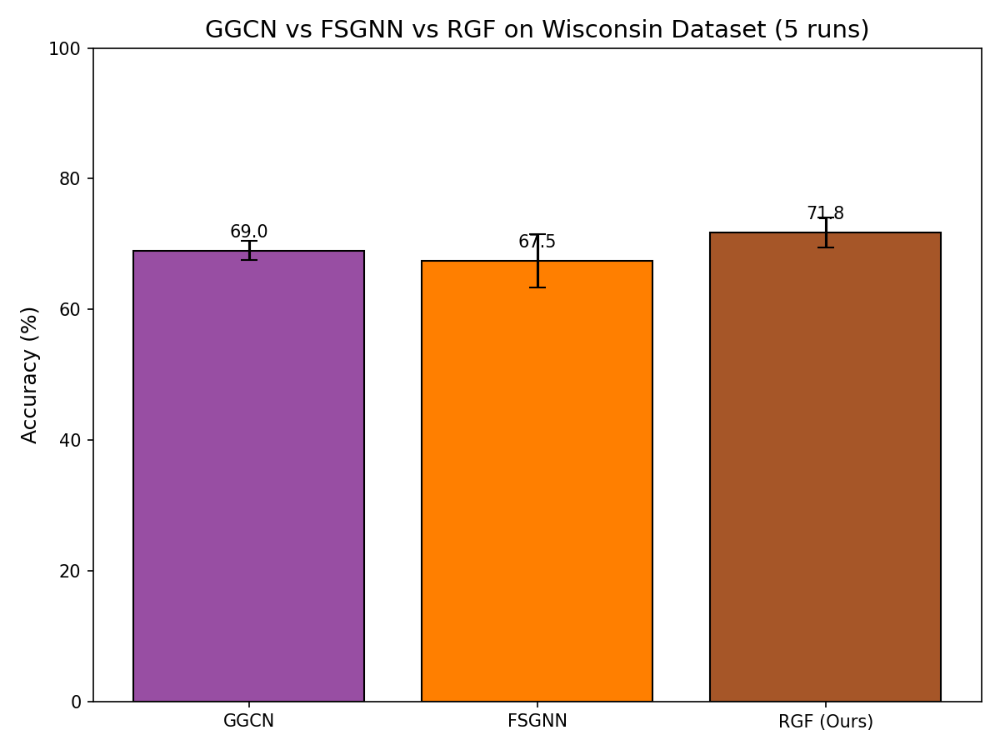
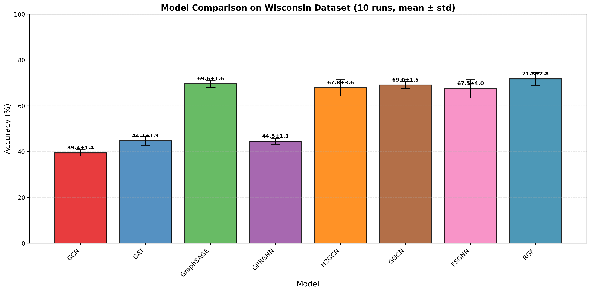
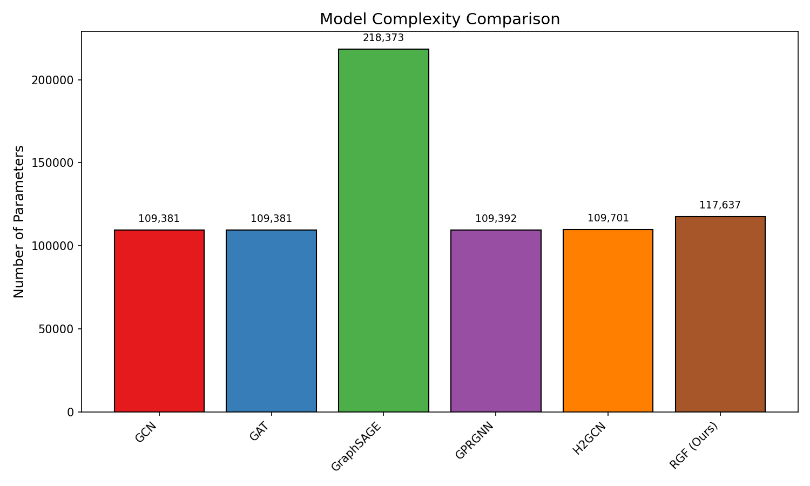
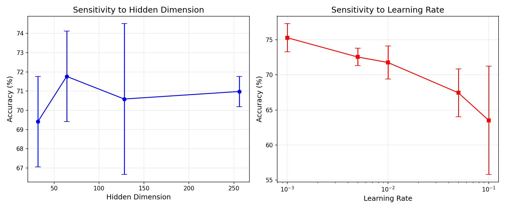
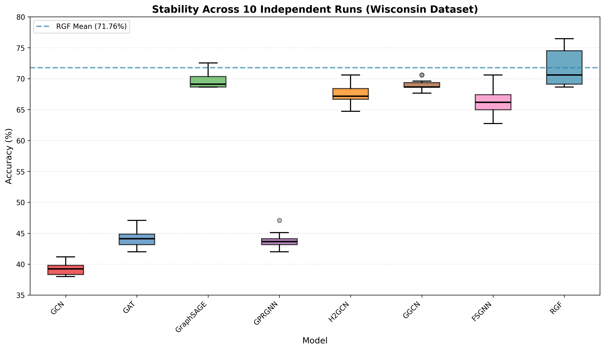
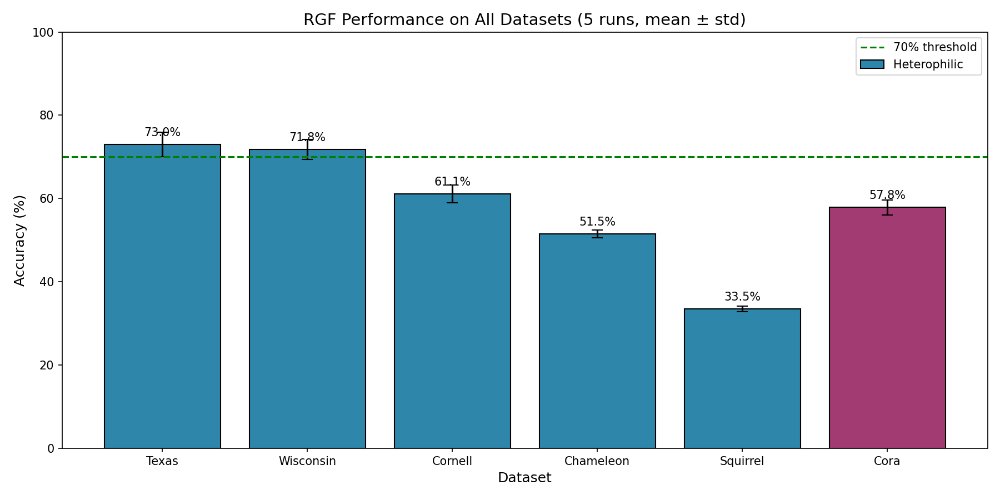

<div align="center">

# 🧠 Residual Graph Fusion (RGF)

### A Lightweight Residual-Gated Graph Neural Network for Heterophilic & Noisy Graph Learning

---


---

### 🔬 Heterophily • Robust Learning • Residual Fusion • Graph AI

</div>
---

## 📌 Overview

**Residual Graph Fusion (RGF)** is a lightweight Graph Neural Network designed to simultaneously address **two critical challenges** in node classification:

| Challenge | Solution |
|:----------|:---------|
| 🔗 **Heterophilic Graphs** (connected nodes have different labels) | Learnable gate adaptively balances local vs neighborhood information ($g \approx 0.73$) |
| 🛡️ **Feature Noise** (corrupted node attributes) | Residual connection preserves clean signals ($+36.67\%$ robustness) |

---

## 🎯 Key Results

<div align="center">

| Dataset | Type | RGF Accuracy | Improvement over GCN |
|:--------|:----:|-------------:|---------------------:|
| **Wisconsin** | Heterophilic | **71.76% ± 2.80%** | **+32.35%** |
| **Texas** | Heterophilic | **72.97% ± 2.96%** | **+41.44%** |
| **Cornell** | Heterophilic | **61.08% ± 2.16%** | **+25.94%** |
| **Chameleon** | Heterophilic | **51.49% ± 0.90%** | **+19.99%** |
| **Squirrel** | Heterophilic | **33.45% ± 0.64%** | **+6.15%** |

</div>

**📊 Under 30% Gaussian feature noise:** RGF maintains **66.67%** accuracy while GCN drops to **30.0%** → **+36.67% absolute improvement**

---

### 🏗️ Architecture

### RGF Architecture



### Mathematical Formulation

The core of the model follows a three-step process:

### 1. Feature Transformation
Local and neighborhood features are extracted using separate linear transformations, followed by ReLU activation:

$$
\mathbf{H}_{\text{local}} = \text{ReLU}(\mathbf{X} \mathbf{W}_1)
$$

$$
\mathbf{H}_{\text{neigh}} = \text{ReLU}(\hat{\mathbf{A}} \mathbf{X} \mathbf{W}_1)
$$

> **Note:** Both transformations share the same weight matrix $\mathbf{W}_1$.

---

### 2. Gated Fusion
A gating mechanism adaptively combines local and neighborhood representations:

$$
\mathbf{g} = \sigma\left([\mathbf{H}_{\text{local}} \mid \mathbf{H}_{\text{neigh}}] \, \mathbf{W}_2\right)
$$

$$
\mathbf{H} = \mathbf{g} \odot \mathbf{H}_{\text{local}} + (\mathbf{1} - \mathbf{g}) \odot \mathbf{H}_{\text{neigh}}
$$

Where:
- $[\cdot \mid \cdot]$ denotes **concatenation**
- $\sigma$ is the **sigmoid** activation function
- $\odot$ is **element-wise multiplication**
- $\mathbf{1}$ is the all‑ones vector

---

### 3. Classification
The final representation is passed through a softmax layer for multi-class prediction:

$$
\hat{\mathbf{Y}} = \text{softmax}(\mathbf{H} \mathbf{W}_3)
$$

---

## Summary of Parameters

| Symbol | Description |
|--------|-------------|
| $\mathbf{X}$ | Input feature matrix |
| $\hat{\mathbf{A}}$ | Normalized adjacency matrix |
| $\mathbf{W}_1, \mathbf{W}_2, \mathbf{W}_3$ | Learnable weight matrices |
| $\mathbf{g}$ | Gate vector (values in $[0,1]$) |
| $\mathbf{H}$ | Fused hidden representation |

---

## 📈 Visual Results

### 🔗 Dataset Heterophily


### 🛡️ Noise Sensitivity


### ⚙️ Accuracy vs Parameters


### 📊 GGCN vs FSGNN vs RGF


### 📈 Journal Comparison with Error Bars


### 🚀 Computational Complexity


### 🎛️ Sensitivity Analysis


### 🔄 Run Stability


### 🏆 Performance Across All Datasets

---

## 🚀 Quick Start

### Installation

```bash
git clone https://github.com/AIRESEARCHER20/RGF-Noise-Resilient.git
cd RGF-Noise-Resilient
pip install -r requirements.txt
